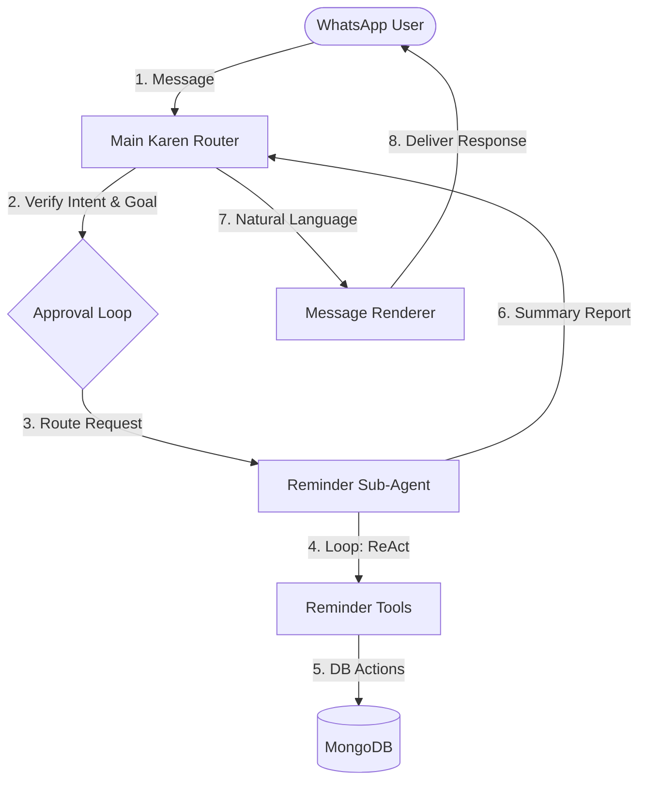

# Karen Multi-Agent Orchestration Architecture
> [!NOTE]
> This document outlines the proposed design to transition Karen from a single-LLM proposal engine into a modern, robust **Multi-Agent Orchestration Substrate** with specialized sub-agents, looping ReAct behaviors, and a verification-approval workflow.

---

## 1. Current State: Which LLM is Handling Reminders?
Currently, Karen uses **`gpt-4o`** (GPT-4o) with strict, deterministic structured outputs (`response_format: { type: "json_schema" }` and `temperature: 0.0`). 
- **The Pipeline**: Meta Webhook $\rightarrow$ `InboundMessagePipeline` $\rightarrow$ `AIProposalRuntime` $\rightarrow$ `OpenAIAdapter` (GPT-4o) $\rightarrow$ `CommandExecutor`.
- **Limitation**: The model is a **one-shot proposal engine**. It cannot perform looping actions, iteratively reason over tools, or dynamically execute bulk state mutations directly.

---

## 2. Proposed Agentic Substrate Architecture
To enable complex reasoning (like "delete all my reminders for today"), we will transition to an **Orchestrator-Worker Multi-Agent Pattern**:



---

## 3. Core Architectural Components

### A. The Main Karen Router (Orchestrator)
The orchestrator acts as the "executive center":
1. **Classification**: Parses user query, retrieves fast session memory, and determines target worker sub-agent.
2. **Safety & Verification Loop**: Before delegating to the worker:
   - Evaluates the **risk profile** of the action (e.g. read operations = low risk, delete/mutate all operations = high risk).
   - If high risk, it establishes a **Goal Proposal** (e.g., *"I intend to cancel 3 scheduled reminders for today"*).
   - Renders this goal to the user on WhatsApp or validates it against safety heuristics, executing only upon verified user confirmation.

### B. Specialized Reminder Sub-Agent (The Worker)
A specialized agent powered by a smaller/cheaper model (like `gpt-4o-mini`) or dedicated prompt instructions, executing in a **ReAct loop (Reasoning $\rightarrow$ Action $\rightarrow$ Observation)**:
- **State Tracker**: Actively holds the conversation thread and current active reminders list.
- **Autonomous Tools**:
  - `list_active_reminders(userId)`: Reads current schedules from the database.
  - `cancel_reminder(taskId)`: Deletes/acknowledges a specific timer.
  - `reschedule_reminder(taskId, newDueAt)`: Updates a reminder's target time.

---

## 4. Bulk Execution Sequence: "Remove all reminders for today"

```mermaid
sequenceDiagram
    autonumber
    actor User as User (WhatsApp)
    participant Main as Main Karen Router
    participant Sub as Reminder Sub-Agent
    database DB as MongoDB
    
    User->>Main: "Remove all reminders for today"
    Main->>Sub: Delegate command with userContext
    Sub->>DB: Query: list_active_reminders(today)
    DB-->>Sub: Return [Task 1, Task 2, Task 3]
    Sub->>Main: Propose Goal: "Cancel 3 reminders"
    Main-->>User: WhatsApp: "You have 3 active reminders today. Should I remove them?"
    User->>Main: "Yes, go ahead"
    Main->>Sub: Authorized. Execute.
    loop One by One
        Sub->>DB: cancel_reminder(taskId)
        DB-->>Sub: Acknowledged
    end
    Sub->>Main: Return Execution Report (3 reminders cancelled)
    Main->>User: WhatsApp: "All done! I have cancelled your 3 reminders..."
```

---

## 5. Sub-Agent Interface Definition
Each sub-agent will implement a unified programmatic contract:

```typescript
export interface IAgentGoal {
  intent: string;
  targetCount: number;
  description: string;
  riskLevel: 'LOW' | 'HIGH';
}

export interface IAgentResult {
  status: 'SUCCESS' | 'FAILED';
  summaryReport: string;
  mutationsCount: number;
}

export interface ISubAgent {
  name: string;
  establishGoal(query: string, context: any): Promise<IAgentGoal>;
  execute(goal: IAgentGoal, context: any): Promise<IAgentResult>;
}
```

---

> [!TIP]
> This Multi-Agent strategy cleanly separates orchestration from bulk domain updates, keeping Karen modular, deterministic, and highly conversational.
